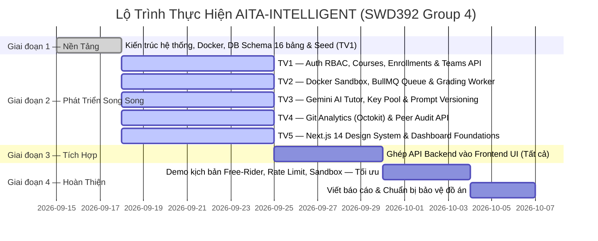

# BẢNG PHÂN CHIA CÔNG VIỆC 5 THÀNH VIÊN (TEAM TASK ALLOCATION)

> **Dự án:** AITA-INTELLIGENT — AI-Powered Teaching Assistant & AST Code Analytics Platform  
> **Môn học:** SWD392 – Software Architecture & Design Project (FPT University Quy Nhơn)  
> **Nhóm thực hiện:** Group 4  
> **Tech Stack:** Next.js 14 · Express + TypeScript · PostgreSQL 16 · Redis · BullMQ · Docker · Gemini AI  

---

## 👥 Danh Sách 5 Thành Viên & Vai Trò

1. **Thành viên 1** – Software Architect & Core Auth Engineer (Trưởng nhóm / Kiến trúc sư)
2. **Thành viên 2** – Docker Sandbox & Autograding Engineer
3. **Thành viên 3** – AI Engine & Key Rotation Engineer
4. **Thành viên 4** – Git Analytics & Peer Audit Engineer
5. **Thành viên 5** – Frontend Lead & UI/UX & QA

---

## 1. Bản Đồ Phân Bổ Trách Nhiệm (Responsibility Matrix - RACI)

Hệ thống được chia thành **5 vai trò chuyên biệt** tương ứng với 5 trụ cột kỹ thuật của dự án, đảm bảo khối lượng công việc cân bằng, độc lập, không chồng chéo và minh bạch khi chấm điểm đồ án:

| Vai Trò | Trọng Tâm Nhiệm Vụ | Module Backend Phụ Trách | Bảng DB Phụ Trách | Business Rules |
| :--- | :--- | :--- | :--- | :--- |
| **Role 1: Software Architect & Core Auth** | Kiến trúc hệ thống, JWT Auth RBAC, Quản lý môn học, ghi danh & nhóm, Docker Compose | `auth`, `courses`, `teams` | `users`, `courses`, `course_enrollments`, `teams`, `team_members` | BR-01 |
| **Role 2: Docker Sandbox & Autograding** | Docker Sandbox Container cô lập, BullMQ Queue, Chấm bài tự động, Rubric Test Case | `assignments`, `submissions`, `grading` | `assignments`, `rubric_rules`, `submissions`, `grading_jobs`, `grading_results` | BR-03, BR-06 |
| **Role 3: AI Engine & Key Rotation** | Gemini AI Tutor Socratic, Chat Sessions, Key Pool AES-256, Prompt Versioning, Rotation | `ai-tutor` | `ai_api_keys`, `prompt_templates`, `tutor_chat_sessions`, `tutor_chat_messages` | BR-02, BR-04, BR-05 |
| **Role 4: Git Analytics & Peer Audit** | Octokit GitHub API, LOC Parser, Free-Rider Detection, Đánh giá chéo nội bộ nhóm | `git-analytics`, `peer-audits` | `git_commits`, `peer_audits` | BR-07, BR-08 |
| **Role 5: Frontend Lead & UI/UX & QA** | Toàn bộ Next.js 14 UI — Dashboard Student/Lecturer/Admin, Glassmorphic Design, Testing | `client/` toàn bộ | Tích hợp tất cả API | Phụ trợ BR-01→BR-08 |

---

## 2. Chi Tiết Nhiệm Vụ Từng Thành Viên

### 👤 Thành Viên 1: Software Architect & Core Auth Engineer
*Nhiệm vụ: Thiết kế kiến trúc tổng thể, xây dựng nền tảng xác thực và phân quyền, quản lý môn học, ghi danh và nhóm.*

- **Kiến trúc & DevOps:**
  - Thiết lập và duy trì `docker-compose.yml` khởi động đồng bộ PostgreSQL (port 5432) và Redis (port 6379).
  - Cấu hình Express server `src/index.ts`, CORS, middleware pipeline, health check endpoint `/api/health`.
  - Quản lý file `.env.example`, `tsconfig.json`, `.gitignore` — đảm bảo an toàn bí mật hệ thống.
  - Thiết kế `database/schema.sql` cho các bảng nền tảng: `users`, `courses`, `course_enrollments`, `teams`, `team_members` và viết `database/seed.sql` nạp dữ liệu mẫu.

- **Module `auth` — Đăng nhập & Phân quyền JWT:**
  - API `POST /api/auth/register`: Hash mật khẩu bằng **Bcrypt (salt = 10)** trước khi lưu (`BR-01`).
  - API `POST /api/auth/login`: Xác thực email/password, cấp **JWT Access Token** với payload `{ userId, role }`.
  - Viết `src/common/auth.middleware.ts`: Middleware `authenticateJWT` xác minh token và middleware `requireRole('ADMIN' | 'LECTURER' | 'STUDENT')` kiểm tra RBAC 3 cấp.

- **Module `courses` — Quản lý Môn học & Ghi danh:**
  - API `GET /api/courses`: Lấy danh sách môn học (Giảng viên xem môn mình dạy, Admin xem tất cả).
  - API `POST /api/courses`: Giảng viên tạo môn học mới.
  - API `GET /api/courses/:id`: Chi tiết môn học kèm danh sách nhóm và sinh viên.
  - API `POST /api/courses/:id/enroll`: Ghi danh sinh viên vào khóa học (`course_enrollments`).
  - API `GET /api/courses/:id/students`: Lấy danh sách sinh viên đã ghi danh vào môn học.

- **Module `teams` — Quản lý Nhóm:**
  - API `POST /api/teams`: Giảng viên tạo nhóm, gán `repo_url` GitHub cho nhóm.
  - API `POST /api/teams/:teamId/members`: Thêm sinh viên vào nhóm với `assigned_module` và `role` (`LEADER` / `MEMBER`).
  - API `GET /api/teams/:teamId`: Lấy thông tin nhóm và danh sách thành viên.

---

### 👤 Thành Viên 2: Docker Sandbox & Autograding Engineer
*Nhiệm vụ: Xây dựng pipeline chấm bài tự động trong Docker Container cô lập và hàng đợi xử lý bất đồng bộ.*

- **Sandbox Runner (`server/sandbox-images/`):**
  - Viết `Dockerfile` cho từng ngôn ngữ hỗ trợ (Python, JavaScript/Node.js): Non-root user, network disabled, ulimit.
  - Cấu hình **giới hạn tài nguyên container**: CPU 0.5 core · RAM 256MB · Timeout 10–30 giây (`BR-03`).
  - Dùng thư viện `dockerode` để tạo container, chạy code sinh viên, đọc stdout/stderr và xóa container sau khi hoàn tất.

- **Module `assignments` — Quản lý Bài Tập & Rubric:**
  - API `POST /api/assignments`: Giảng viên tạo bài tập với `start_date`, `due_date`, `max_score`, `submission_type` (`INDIVIDUAL` / `TEAM`).
  - API `POST /api/assignments/:id/rubrics`: Thêm **Rubric Rule** (AUTOMATED / MANUAL / AI_ANALYSIS), thiết lập `is_hidden = true` cho test case ẩn.
  - API `GET /api/assignments/:id/rubrics`: Trả về test case — Sinh viên chỉ thấy kết quả Đạt/Không Đạt với test ẩn, không xem được `input_data` / `expected_output` (`BR-06`).

- **Module `submissions` — Nộp bài:**
  - API `POST /api/submissions`: Sinh viên nộp `artifact_url` (URL GitHub/file zip) và `git_commit_hash`, lưu `submitted_by_user_id`. Hệ thống tự động tạo **Grading Job** với priority tương ứng và đưa vào BullMQ Queue.
  - API `GET /api/submissions/:id`: Lấy trạng thái bài nộp (SUBMITTED → QUEUED → GRADING → GRADED | FAILED).

- **Module `grading` — Worker Chấm Bài (BullMQ & Redis):**
  - Cấu hình **BullMQ Worker** kết nối Redis, lắng nghe queue `grading-queue`.
  - Luồng xử lý: Kéo code từ `artifact_url` → Spin up Docker Container (`sandbox_container_id`) → Chạy từng Rubric Rule → So sánh `actual_output` với `expected_output` → Lưu `grading_results` (ứng với từng `rubric_rule_id`) → Cập nhật `status = 'COMPLETED'`.
  - Xử lý lỗi: Nếu container timeout hoặc crash → Cập nhật `status = 'FAILED'`, lưu log lỗi và tăng `retry_count`.
  - API `GET /api/grading/:jobId/results`: Lấy kết quả chi tiết từng test case và nhận xét AI feedback.

---

### 👤 Thành Viên 3: AI Engine & Key Rotation Engineer
*Nhiệm vụ: Tích hợp Gemini AI làm trợ giảng Socratic, quản lý Key Pool mã hóa AES-256 và Prompt Template versioning.*

- **Bảo mật AI API Keys (`ai_api_keys`):**
  - Viết service mã hóa/giải mã **AES-256** cho `api_key_encrypted` trước khi lưu vào DB (`BR-02`).
  - API Admin `GET /api/ai-tutor/admin/keys`: Xem danh sách key, trạng thái (`ACTIVE` / `RATE_LIMITED` / `EXHAUSTED`), `usage_count`, `rotated_at`.
  - API Admin `POST /api/ai-tutor/admin/keys`: Thêm key Gemini mới vào pool.
  - API Admin `PATCH /api/ai-tutor/admin/keys/:id/status`: Thay đổi trạng thái key thủ công.

- **Logic Key Rotation tự động (`BR-04`):**
  - Hàm `getNextActiveApiKey()`: Luôn chọn key `ACTIVE` có `usage_count` thấp nhất (Least-Used / Round-robin).
  - Khi gặp HTTP 429 (Rate Limit) từ Gemini: Tự động đánh dấu key hiện tại thành `RATE_LIMITED`, gọi lại `getNextActiveApiKey()` và thử request tiếp theo.
  - Cập nhật `usage_count++` và `rotated_at` sau mỗi lần gọi.

- **Prompt Template Versioning (`BR-05`):**
  - Bảng `prompt_templates` lưu `version` (v1.0, v2.0...) cho mỗi system prompt (`purpose`: `Grading`, `TutorChat`).
  - API `GET /api/ai-tutor/admin/prompts`: Liệt kê tất cả template theo `purpose`.
  - API Admin `POST /api/ai-tutor/admin/prompts`: Thêm version mới, không ghi đè version cũ (audit trail).

- **Module `ai-tutor` — Chatbot Trợ giảng Socratic & Chat Sessions:**
  - API `POST /api/ai-tutor/sessions`: Tạo phiên chat mới (`tutor_chat_sessions`), gắn với `submission_id` hoặc `assignment_id`.
  - API `GET /api/ai-tutor/sessions/:sessionId/messages`: Lấy lịch sử tin nhắn của phiên chat.
  - API `POST /api/ai-tutor/sessions/:sessionId/chat`: Sinh viên gửi câu hỏi → Hệ thống lấy Prompt Template phù hợp → Gọi Gemini AI với phong cách **Socratic** (dẫn dắt gợi ý, không cho đáp án thẳng) → Lưu tin nhắn vào `tutor_chat_messages`.
  - Tích hợp **AI Grading Feedback**: Sau khi chấm xong, gọi Gemini sinh ra `ai_feedback` nhận xét code chi tiết cho từng rubric rule trong `grading_results`.

---

### 👤 Thành Viên 4: Git Analytics & Peer Audit Engineer
*Nhiệm vụ: Phân tích đóng góp cá nhân từ GitHub, phát hiện free-rider và xây dựng hệ thống đánh giá chéo nội bộ nhóm.*

- **Module `git-analytics` — Phân tích GitHub:**
  - Dùng thư viện `@octokit/rest` gọi **GitHub REST API** để kéo commit history của `repo_url` nhóm.
  - API `POST /api/git/:teamId/sync`: Trigger đồng bộ commit history mới nhất từ GitHub vào bảng `git_commits`.
  - Với mỗi commit, lưu `commit_hash`, `author_user_id` (map từ GitHub email sang `users.user_id`), `lines_added`, `lines_deleted`, `committed_at`.
  - **Bộ lọc Noise (BR-07):** Loại bỏ các file sinh tự động (`node_modules/`, `dist/`, `build/`, `package-lock.json`, `.next/`) khỏi thống kê LOC để tính đóng góp thực chất.
  - API `GET /api/git/:teamId/commits`: Trả về danh sách commit và bảng thống kê tổng hợp `lines_added` / `lines_deleted` / `total_commits` per thành viên.
  - **Free-Rider Detection (`BR-07`):** So sánh tỷ lệ đóng góp từng thành viên (LOC%) — nếu thấp hơn ngưỡng (ví dụ: <5% tổng nhóm), tự động đánh dấu cảnh báo cho Giảng viên.

- **Module `peer-audits` — Đánh giá Chéo Nội bộ:**
  - API `POST /api/peer-audits`: Sinh viên gửi đánh giá thành viên cùng nhóm: `team_id`, `assignment_id`, `reviewer_id`, `reviewee_id`, `audit_round`, `score`, `comments`.
  - **Ràng buộc DB cứng (`BR-08`):** Constraint `CHECK (reviewer_id <> reviewee_id)` ở tầng database cấm sinh viên tự đánh giá chính mình và `UNIQUE (assignment_id, reviewer_id, reviewee_id, audit_round)`.
  - API `GET /api/peer-audits/team/:teamId/assignment/:assignmentId`: Lấy danh sách phiếu đánh giá theo đợt nộp bài.
  - API `GET /api/peer-audits/team/:teamId/summary`: Tính điểm trung bình đánh giá chéo từng thành viên trong nhóm (`AVG(score)` group by `reviewee_id`), phục vụ Giảng viên.

---

### 👤 Thành Viên 5: Frontend Lead & UI/UX & QA
*Nhiệm vụ: Xây dựng toàn bộ giao diện Next.js 14 với thiết kế Glassmorphic tối, tích hợp tất cả API và đảm bảo chất lượng kiểm thử.*

- **Hệ thống Design (`client/src/styles/`):**
  - Xây dựng **Global CSS Design System** Glassmorphic Dark Theme: Màu nền tối (`#0a0a1a`), backdrop-filter blur, gradient tím-xanh `#7c3aed → #2563eb`.
  - Định nghĩa CSS Variables cho màu sắc, spacing, border-radius, box-shadow — đảm bảo nhất quán toàn app.
  - Typography: Google Font **Inter** hoặc **Outfit**, smooth micro-animations (`transition: all 0.3s ease`).

- **Trang Landing & Auth (`client/src/app/page.tsx` & `(auth)/`):**
  - Trang chủ giới thiệu hệ thống AITA-INTELLIGENT với hero section, feature highlights.
  - Trang Login: Form đăng nhập, gọi `POST /api/auth/login`, lưu JWT vào `localStorage`, phân quyền route client-side theo role.

- **Dashboard Sinh viên (`client/src/app/(dashboard)/student/`):**
  - Hiển thị danh sách môn học đang học, bài tập còn deadline.
  - Trang nộp bài: Form nhập `artifact_url` + `git_commit_hash`, submit và theo dõi trạng thái chấm bài thời gian thực (polling 3s).
  - Xem kết quả chấm bài: Điểm chi tiết từng test case Rubric, badge Đạt/Không Đạt, AI Feedback.
  - **Chatbot AI Tutor**: Giao diện chat theo Session, gửi câu hỏi và nhận gợi ý Socratic từ Gemini AI.
  - Xem báo cáo đóng góp nhóm Git: Biểu đồ cột LOC per thành viên, badge cảnh báo Free-Rider.
  - Phiếu đánh giá chéo: Form chọn thành viên cùng nhóm (loại trừ chính mình), nhập điểm và nhận xét theo vòng đánh giá.

- **Dashboard Giảng viên (`client/src/app/(dashboard)/lecturer/`):**
  - Quản lý môn học, sinh viên & nhóm: Tạo nhóm, ghi danh sinh viên, gán phân hệ, cập nhật `repo_url`.
  - Tạo bài tập & Rubric: Form tạo bài tập, thêm test case với toggle ẩn/hiện.
  - Xem kết quả lớp: Bảng điểm tổng hợp theo tiêu chí, lọc theo nhóm/trạng thái.
  - Báo cáo Git Analytics: Bảng đóng góp tất cả nhóm, highlight thành viên có dấu hiệu Free-Riding.
  - Xem tổng hợp Peer Audit theo đợt và vòng đánh giá.

- **Dashboard Admin (`client/src/app/(dashboard)/admin/`):**
  - Quản lý AI API Key Pool: Danh sách key, trạng thái, usage count, nút thêm key mới.
  - Quản lý Prompt Template: Danh sách template theo `purpose` và `version`, form tạo version mới.
  - Giám sát hệ thống: Hiển thị dữ liệu health check từ `/api/health`.

- **QA & Kiểm thử:**
  - Viết kịch bản test API bằng **Postman Collection**: Toàn bộ endpoints của các modules.
  - Chuẩn bị bộ dữ liệu demo cho buổi bảo vệ:
    - Kịch bản 1: Sinh viên nộp code đúng → chạy sandbox thành công → chấm điểm chi tiết theo rubric.
    - Kịch bản 2: Sinh viên nộp code lỗi runtime → sandbox timeout → trạng thái `FAILED`.
    - Kịch bản 3: Nhóm có 1 sinh viên ít commit/LOC thấp → hệ thống phát hiện Free-Rider, cảnh báo Giảng viên.
    - Kịch bản 4: AI API Key bị Rate Limit 429 → hệ thống tự xoay sang key dự phòng tiếp tục phục vụ.
  - Kiểm tra toàn bộ UI responsive trên các viewport (desktop 1440px · tablet 768px · mobile 375px).

---

## 3. Lộ Trình Triển Khai (Milestone Roadmap)

---

## 4. Quy Trình Phối Hợp Trên GitHub

### Chiến lược nhánh (Git Branching Strategy)

| Nhánh | Mục đích | Phụ trách chính |
| :--- | :--- | :--- |
| `main` | Production-ready code (chỉ merge khi build passed, test E2E đạt) | Cả nhóm |
| `develop` | Nhánh tích hợp chung (merge từ các feature sau review) | Cả nhóm |
| `feature/auth-courses-teams` | Auth RBAC · Courses · Enrollments · Teams API | **Thành viên 1** |
| `feature/sandbox-autograding` | Docker Sandbox · BullMQ · Rubric Grading Worker | **Thành viên 2** |
| `feature/ai-engine-key-rotation` | Gemini AI Tutor · Key Pool Rotation · Prompt Versioning | **Thành viên 3** |
| `feature/git-analytics-peer-audit` | Octokit Git Sync · Free-Rider Detection · Peer Audit API | **Thành viên 4** |
| `feature/frontend-dashboard-ui` | Next.js 14 · Glassmorphic UI · Toàn bộ Dashboards | **Thành viên 5** |

### Quy tắc làm việc nhóm:
1. Mỗi Pull Request (PR) phải có ít nhất **1 thành viên khác review và approve**.
2. Phải chạy `npm run build` không lỗi trước khi merge code vào `develop`.
3. Format commit message: `[TV{số}] feat/fix/refactor: Nội dung công việc`.

---

## 5. Danh Sách API Endpoints Phân Chia Theo Thành Viên

| Thành viên | Method | Endpoint | Mô tả chức năng |
| :--- | :--- | :--- | :--- |
| **TV1** | POST | `/api/auth/register` | Đăng ký tài khoản, mã hóa Bcrypt |
| **TV1** | POST | `/api/auth/login` | Đăng nhập, cấp JWT Access Token |
| **TV1** | GET | `/api/courses` | Lấy danh sách môn học |
| **TV1** | POST | `/api/courses` | Giảng viên tạo môn học mới |
| **TV1** | POST | `/api/courses/:id/enroll` | Ghi danh sinh viên vào lớp học |
| **TV1** | GET | `/api/courses/:id/students` | Lấy danh sách sinh viên trong lớp |
| **TV1** | POST | `/api/teams` | Giảng viên tạo nhóm và gắn `repo_url` |
| **TV1** | POST | `/api/teams/:id/members` | Thêm sinh viên vào nhóm kèm vai trò & module |
| **TV2** | POST | `/api/assignments` | Giảng viên tạo bài tập / Milestone |
| **TV2** | POST | `/api/assignments/:id/rubrics` | Thêm tiêu chí Rubric / test case ẩn/hiện |
| **TV2** | POST | `/api/submissions` | Nộp bài (`artifact_url`, `commit_hash`) → BullMQ Queue |
| **TV2** | GET | `/api/grading/:jobId/results` | Lấy kết quả chấm chi tiết từng tiêu chí Rubric |
| **TV3** | POST | `/api/ai-tutor/sessions` | Khởi tạo phiên chat với Trợ giảng AI |
| **TV3** | GET | `/api/ai-tutor/sessions/:id/messages` | Lấy lịch sử chat theo từng phiên |
| **TV3** | POST | `/api/ai-tutor/sessions/:id/chat` | Gửi câu hỏi và nhận gợi ý Socratic từ Gemini AI |
| **TV3** | GET | `/api/ai-tutor/admin/keys` | Quản lý AI Key Pool, kiểm tra xoay tua key |
| **TV3** | GET | `/api/ai-tutor/admin/prompts` | Quản lý các phiên bản Prompt Template |
| **TV4** | POST | `/api/git/:teamId/sync` | Kéo commit history từ GitHub về hệ thống |
| **TV4** | GET | `/api/git/:teamId/commits` | Lấy commit list & thống kê LOC, cảnh báo Free-Rider |
| **TV4** | POST | `/api/peer-audits` | Gửi phiếu đánh giá chéo thành viên cùng nhóm |
| **TV4** | GET | `/api/peer-audits/team/:id/assignment/:assignmentId` | Xem kết quả đánh giá chéo theo đợt bài tập |
| **TV4** | GET | `/api/peer-audits/team/:id/summary` | Tổng hợp điểm trung bình đánh giá chéo của nhóm |
| **TV5** | *(UI)* | `localhost:3000/student` | Toàn bộ Dashboard Sinh viên |
| **TV5** | *(UI)* | `localhost:3000/lecturer` | Toàn bộ Dashboard Giảng viên |
| **TV5** | *(UI)* | `localhost:3000/admin` | Toàn bộ Dashboard Quản trị viên |
