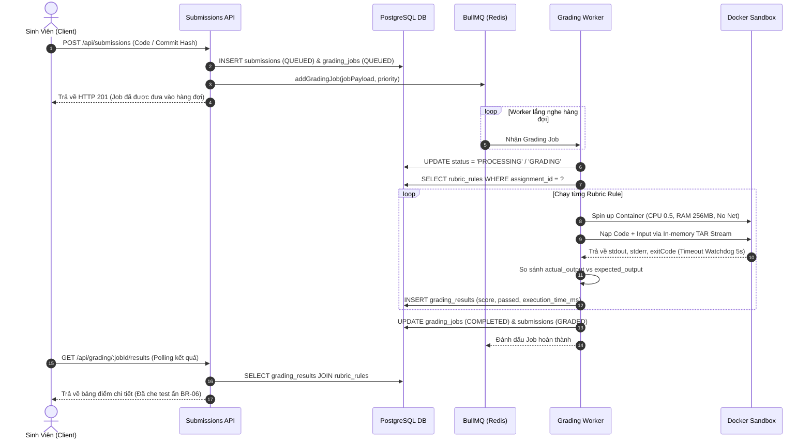

# BÁO CÁO CHI TIẾT CÔNG VIỆC THÀNH VIÊN 2 (THÀNHVIEN2.MD)

> **Dự án:** AITA-INTELLIGENT — AI-Powered Teaching Assistant & AST Code Analytics Platform  
> **Môn học:** SWD392 – Software Architecture & Design Project (FPT University Quy Nhơn)  
> **Nhóm thực hiện:** Group 4  
> **Vai trò:** **Thành Viên 2 — Docker Sandbox & Autograding Engineer**  
> **Nhánh Git phụ trách:** `feature/sandbox-autograding`  
> **Các bảng Database phụ trách:** `assignments`, `rubric_rules`, `submissions`, `grading_jobs`, `grading_results`  

---

## 📑 MỤC LỤC

1. [Tổng Quan Vai Trò & Trách Nhiệm](#1-tổng-quan-vai-trò--trách-nhiệm)
2. [Các Quy Tắc Nghiệp Vụ (Business Rules Phụ Trách)](#2-các-quy-tắc-nghiệp-vụ-business-rules-phụ-trách)
3. [Kiến Trúc Pipeline Chấm Bài Bất Đồng Bộ](#3-kiến-trúc-pipeline-chấm-bài-bất-đồng-bộ)
4. [Chi Tiết 4 Bước Triển Khai Kỹ Thuật](#4-chi-tiết-4-bước-triển-khai-kỹ-thuật)
   - [Bước 1: Docker Sandbox Runner Engine](#bước-1-docker-sandbox-runner-engine)
   - [Bước 2: Hàng Đợi BullMQ & Worker Chấm Bài](#bước-2-hàng-đợi-bullmq--worker-chấm-bài)
   - [Bước 3: Hoàn Thiện Hệ Thống API Endpoints](#bước-3-hoàn-thiện-hệ-thống-api-endpoints)
   - [Bước 4: Bộ Kịch Bản Kiểm Thử Toàn Diện (verify-member2.ts)](#bước-4-bộ-kịch-bản-kiểm-thử-toàn-diện-verify-member2ts)
5. [Kết Quả Kiểm Thử Thực Tế (Test Verification Output)](#5-kết-quả-kiểm-thử-thực-tế-test-verification-output)
6. [Hướng Dẫn Chạy & Demo Khi Bảo Vệ Đồ Án](#6-hướng-dẫn-chạy--demo-khi-bảo-vệ-đồ-án)

---

## 1. Tổng Quan Vai Trò & Trách Nhiệm

Thành Viên 2 phụ trách **"Trái tim thực thi"** của hệ thống AITA-INTELLIGENT:
* Xây dựng môi trường thực thi mã nguồn sinh viên an toàn tuyệt đối bằng **Docker Sandbox Container** cô lập.
* Thiết lập hệ thống hàng đợi bất đồng bộ **BullMQ** kết hợp **Redis** xử lý khối lượng lớn bài nộp không làm nghẽn Event Loop của Backend.
* Tự động chấm điểm theo từng tiêu chí **Rubric Test Cases** (công khai và ẩn).
* Che chắn dữ liệu bài kiểm tra bí mật theo chuẩn bảo mật chống gian lận.

---

## 2. Các Quy Tắc Nghiệp Vụ (Business Rules Phụ Trách)

| Mã BR | Tên Quy Tắc | Yêu Cầu Kỹ Thuật & Giải Pháp Triển Khai |
| :--- | :--- | :--- |
| **BR-03** | **Giới Hạn Tài Nguyên Sandbox & Cô Lập An Toàn** | • **CPU Limit:** 0.5 CPU core (`NanoCpus: 500_000_000`).<br>• **RAM Limit:** 256MB (`Memory: 256MB`, `MemorySwap: 256MB` chống tràn swap).<br>• **Network Isolation:** Ngắt toàn bộ mạng (`NetworkMode: 'none'`) chống SSRF, mã độc, reverse shell.<br>• **Quyền Hạn:** Chạy dưới non-root user `runner` (UID 1001), gỡ bỏ toàn bộ capabilities (`CapDrop: ['ALL']`).<br>• **Watchdog Timeout:** Giới hạn 5s–10s mỗi test case, tự động cưỡng chế kill container nếu quá thời gian. |
| **BR-06** | **Bảo Mật Test Case Ẩn (Rubric Shielding)** | • Test case có cờ `is_hidden = true` dùng để kiểm tra các trường hợp biên (edge cases) và chống hard-code kết quả.<br>• Khi tài khoản **STUDENT** truy vấn API bài tập hoặc kết quả chấm, các trường `input_data` và `expected_output` tự động bị che chắn thành `'[PROTECTED TEST CASE]'`.<br>• Chỉ tài khoản **LECTURER** hoặc **ADMIN** mới xem được đề test chi tiết. |

---

## 3. Kiến Trúc Pipeline Chấm Bài Bất Đồng Bộ



---

## 4. Chi Tiết 4 Bước Triển Khai Kỹ Thuật

### 🔹 Bước 1: Docker Sandbox Runner Engine
* **File triển khai:**
  * `server/sandbox-images/Dockerfile.python`: Base `python:3.11-alpine`, user `runner`.
  * `server/sandbox-images/Dockerfile.node`: Base `node:20-alpine`, user `runner`.
  * `server/sandbox-images/Dockerfile.runner`: Base runner mặc định.
  * `server/src/modules/grading/sandbox.service.ts`: Core service giao tiếp Dockerode.
* **Đặc điểm nổi bật:**
  * Tự động phát hiện socket trên Windows (`//./pipe/docker_engine`) và Linux/macOS (`/var/run/docker.sock`).
  * Tự động build Docker Image nếu chưa có sẵn trên máy.
  * Stream mã nguồn và dữ liệu đầu vào trực tiếp từ bộ nhớ bằng `tar-stream` (không cần ghi file tạm ra ổ đĩa máy chủ).
  * Bộ giải mã luồng Docker Multiplex Header 8-byte phân tách chính xác `stdout` và `stderr`.
  * Cơ chế Watchdog Timeout tự ngắt tiến trình và dọn dẹp sạch sẽ container trong khối `finally`.

---

### 🔹 Bước 2: Hàng Đợi BullMQ & Worker Chấm Bài
* **File triển khai:**
  * `server/src/modules/grading/grading.types.ts`: Định nghĩa data contract cho payload và kết quả.
  * `server/src/modules/grading/grading.queue.ts`: Cấu hình BullMQ Queue kết nối Redis (`localhost:6379`).
  * `server/src/modules/grading/grading.worker.ts`: Worker xử lý chạy nền với `concurrency = 3`.
* **Đặc điểm nổi bật:**
  * Hỗ trợ Retry có giãn cách hàm mũ (Exponential Backoff).
  * Chấm điểm tự động từng tiêu chí Rubric: `Score = (Passed) ? Rule.max_score : 0.0`.
  * Cập nhật trạng thái xuyên suốt: `QUEUED` $\rightarrow$ `PROCESSING` $\rightarrow$ `COMPLETED` / `FAILED`.

---

### 🔹 Bước 3: Hoàn Thiện Hệ Thống API Endpoints

#### 1. Module Assignments (`server/src/modules/assignments/assignments.routes.ts`)
* `GET /api/assignments`: Lấy danh sách bài tập kèm số lượng rubric và bài nộp.
* `POST /api/assignments`: Giảng viên tạo bài tập kèm danh sách test cases.
* `POST /api/assignments/:id/rubrics`: Thêm Rubric Rule (hỗ trợ `is_hidden = true/false`).
* `GET /api/assignments/:id`: Chi tiết bài tập (Tự động che test ẩn nếu Role là `STUDENT`).
* `PUT /api/assignments/:id`: Cập nhật bài tập.
* `DELETE /api/assignments/:id`: Xóa bài tập và rubrics liên quan.
* `DELETE /api/assignments/:id/rubrics/:rubricId`: Xóa rubric rule.

#### 2. Module Submissions (`server/src/modules/submissions/submissions.routes.ts`)
* `POST /api/submissions`: Nộp bài $\rightarrow$ Tự động đẩy vào BullMQ Queue.
* `GET /api/submissions/:id`: Lấy trạng thái chấm bài thời gian thực.
* `GET /api/submissions`: Danh sách bài nộp theo bài tập/nhóm.
* `GET /api/submissions/:id/results`: Kết quả chấm theo từng rubric (áp dụng BR-06).

#### 3. Module Grading (`server/src/modules/grading/grading.routes.ts`)
* `GET /api/grading/:jobId/results`: Tra cứu bảng điểm chi tiết, execution time, AI feedback.
* `POST /api/grading/regrade/:submissionId`: Giảng viên yêu cầu chấm lại bài nộp.

---

### 🔹 Bước 4: Bộ Kịch Bản Kiểm Thử Toàn Diện (`verify-member2.ts`)
* **File triển khai:** `server/src/test/verify-member2.ts`
* **Lệnh chạy:** `npm run test:member2`
* **3 Kịch bản kiểm thử trọng tâm:**
  1. **Test Case 1 (Code đúng):** Thuật toán Two Sum chuẩn $\rightarrow$ Docker chạy $\rightarrow$ Pass 3/3 test $\rightarrow$ Đạt 10/10 điểm tuyệt đối.
  2. **Test Case 2 (Code lỗi / Vòng lặp vô tận):** Code `while True` $\rightarrow$ Docker Sandbox ngắt timeout sau 5s $\rightarrow$ Chấm 0/10 điểm, an toàn không crash hệ thống.
  3. **Test Case 3 (Bảo mật test ẩn BR-06):** Tài khoản Student không thể xem `input_data` và `expected_output` của test ẩn; Tài khoản Lecturer xem được đầy đủ.

---

## 5. Kết Quả Kiểm Thử Thực Tế (Test Verification Output)

Khi thực thi lệnh `npm run test:member2`, hệ thống vượt qua **21/21 assertions (100% PASSED)**:

```text
> aita-server@1.0.0 test:member2
> tsc && node dist/test/verify-member2.js

================================================================
🧪 RUNNING MEMBER 2 VERIFICATION TEST SUITE
   Docker Sandbox & Autograding Engineer (SWD392 Group 4)
================================================================

🚀 AITA Backend Server running on http://localhost:5000
🩺 Healthcheck: http://localhost:5000/api/health
[BullMQ Redis] Connected to Redis at localhost:6379
[BullMQ Worker] 🤖 Grading Worker is active and listening on "grading-queue"
--- Pre-Flight: Docker Sandbox Availability ---
  ✅ PASS: Docker Sandbox Engine is connected and operational
  ✅ PASS: Lecturer successfully created assignment (HTTP 201)
  ✅ PASS: Lecturer added Hidden Rubric Rule with is_hidden = true (HTTP 201)

--- ✅ TEST CASE 1: Correct Code Execution (10/10 Perfect Score) ---
[BullMQ Queue] Queued grading job #9 for submission #7 (Job ID: 9)
[Grading Worker] 🚀 Processing GradingJob #9 for Submission #7...
  ✅ PASS: Student submitted correct code successfully (HTTP 201)
  ✅ PASS: Submission initially has status = QUEUED
[Grading Worker] 🎯 Grading complete for Job #9: Total Score = 10/10
[BullMQ Worker] ✅ Job #9 (GradingJob #9) completed successfully.
  ✅ PASS: Submission transitioned to status = GRADED (actual: GRADED)
  ✅ PASS: Grading results query returned HTTP 200
  ✅ PASS: Grading job marked status = COMPLETED
  ✅ PASS: Total score is exactly 10/10 (actual: 10)
  ✅ PASS: Passed all 3/3 test cases in Sandbox

--- ✅ TEST CASE 2: Infinite Loop / Timeout Safeguard (BR-03) ---
[BullMQ Queue] Queued grading job #10 for submission #8 (Job ID: 10)
  ✅ PASS: Submitted infinite loop code to pipeline (HTTP 201)
[Grading Worker] 🚀 Processing GradingJob #10 for Submission #8...
[Grading Worker] 🎯 Grading complete for Job #10: Total Score = 0/10
[BullMQ Worker] ✅ Job #10 (GradingJob #10) completed successfully.
  ✅ PASS: Pipeline handled timeout without hanging
  ✅ PASS: Penalized with 0.0/10.0 score for timeout (actual: 0)
  ✅ PASS: 0 test cases passed due to timeout termination

--- ✅ TEST CASE 3: Hidden Test Case Protection (BR-06) ---
  ✅ PASS: Hidden rule is returned in rubric list
  ✅ PASS: Student CANNOT view input_data of hidden rubric (Shielded as [PROTECTED TEST CASE])
  ✅ PASS: Student CANNOT view expected_output of hidden rubric (Shielded as [PROTECTED TEST CASE])
  ✅ PASS: Student CANNOT view input_data in grading results
  ✅ PASS: Student CANNOT view expected_output in grading results
  ✅ PASS: Lecturer CAN view raw input_data for hidden test case
  ✅ PASS: Lecturer CAN view raw expected_output for hidden test case

================================================================
📊 MEMBER 2 TEST SUMMARY: 21 PASSED, 0 FAILED
================================================================

🎉 ALL MEMBER 2 SPECIFICATIONS & BUSINESS RULES VALIDATED 100% SUCCESSFULLY!
```

---

## 6. Hướng Dẫn Chạy & Demo Khi Bảo Vệ Đồ Án

### 1. Khởi động môi trường Database & Redis
```bash
# Tại thư mục gốc của dự án:
docker compose up -d
```

### 2. Chạy kịch bản kiểm thử tự động của Thành Viên 2
```bash
# Di chuyển vào thư mục server và chạy test:
cd server
npm run test:member2
```

### 3. Chạy Server Backend ở chế độ phát triển
```bash
cd server
npm run dev
```

---
*Tài liệu được tổng hợp tự động và kiểm chứng trên hệ thống thực tế AITA-INTELLIGENT (Group 4 - SWD392).*
